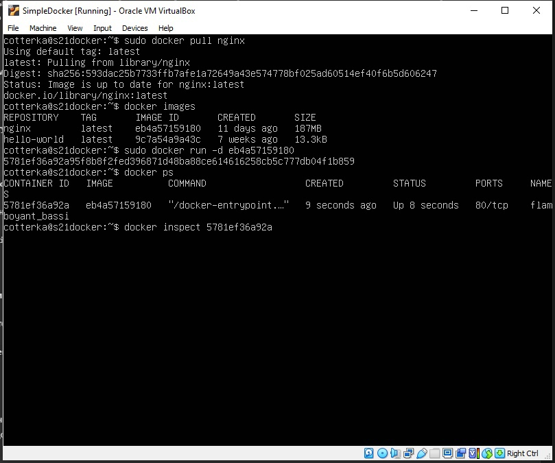

## Part 1. Готовый докер

В качестве конечной цели своей небольшой практики вы сразу выбрали написание докер образа для собственного веб сервера, а потому в начале вам нужно разобраться с уже готовым докер образом для сервера.
Ваш выбор пал на довольно простой nginx.

- Взять официальный докер образ с nginx и выкачать его при помощи **docker pull**


- Проверить наличие докер образа через **docker images**


- Запустить докер образ через **docker run -d [image_id|repository]**


- Проверить, что образ запустился через **docker ps**



- Посмотреть информацию о контейнере через **docker inspect [container_id|container_name]**.  
Поскольку вывод команды достаточно большой, сохраним его в текстовый файл и определим при помощи поиска в nano
  **размер контейнера**, **список замапленных портов** и **IP контейнера**


- Остановить докер образ через **docker stop [container_id|container_name]**


- Проверить, что образ остановился через **docker ps**


- Запустить докер с портами 80 и 443 в контейнере, замапленными на такие же порты на локальной машине, через команду **docker run**


- Проверить, что в браузере по адресу **localhost:80** доступна стартовая страница nginx


- Перезапустить докер контейнер через **docker restart [container_id|container_name]**


- Проверить любым способом, что контейнер запустился


## Part 2. Операции с контейнером

Докер образ и контейнер готовы. Теперь можно покопаться в конфигурации nginx и отобразить статус страницы.

Для начала я создам новый контейнер, присвоив ему имя, чтобы в дальнейшем было удобнее


- Прочитать конфигурационный файл nginx.conf внутри докер контейнера через команду **docker exec**


- Создать на локальной машине файл **nginx.conf**


- Настроить в нем по пути **/status** отдачу страницы статуса сервера nginx

За основу я беру файл **nginx.conf** из контейнера, куда дописываю: 

```c
server {
    location = /status {  // Блок конфигурации для обработки запросов к пути /status. Внутри этого блока определены настройки для обработки таких запросов.
        stub_status  // Директива, которая включает отдачу страницы статуса сервера Nginx. Так при обращении к пути /status, Nginx будет отдавать страницу со статистикой и текущим состоянием сервера.
    }:
};
```


- Скопировать созданный файл nginx.conf внутрь докер образа через команду **docker cp**


- Перезапустить nginx внутри докер образа через команду **docker exec**


- Проверить, что по адресу **localhost:80/status** отдается страничка со статусом сервера nginx


- Экспортировать контейнер в файл **container.tar** через команду **export**


- Остановить контейнер


  


- Удалить образ через **docker rmi [image_id|repository]**, не удаляя перед этим контейнеры

Я забыла заскринить этот этап сразу и ввела команду еще раз, поэтому в выводе отображается, что образа уже нет.


- Удалить остановленный контейнер


  


- Импортировать контейнер обратно через команду **docker import**

  **["nginx", "-g", "daemon off;"]** гарантирует, что Nginx останется «на переднем плане», так что Docker сможет правильно отслеживать процесс (в противном случае контейнер остановится сразу после запуска)


- Запустить импортированный контейнер


- Проверить, что по адресу **localhost:80/status** отдается страничка со статусом сервера nginx


## Part 3. Мини веб-сервер

Настало время немного оторваться от докера, чтобы подготовиться к последнему этапу. Настало время написать свой сервер.

- Написать мини сервер на C и FastCgi, который будет возвращать простейшую страничку с надписью Hello World!


- Запустить написанный мини сервер через spawn-fcgi на порту 8080


- Написать свой nginx.conf, который будет проксировать все запросы с 81 порта на 127.0.0.1:8080


- Проверить, что в браузере по localhost:81 отдается написанная вами страничка


- Положить файл nginx.conf по пути ./nginx/nginx.conf (это понадобится позже)